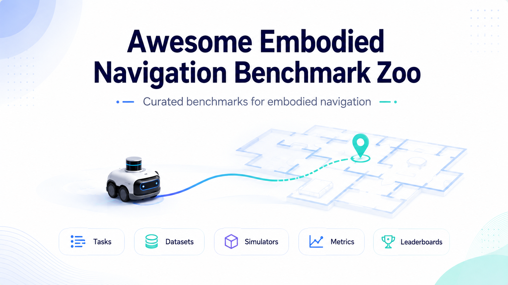

# Awesome Embodied Navigation Benchmark Zoo

[English](README.md) | [简体中文](README.zh-CN.md)

  

面向 embodied navigation、ObjectNav、vision-language navigation、robot navigation、spatial AI 的 curated awesome list 与 benchmark zoo，系统整理数据集、指标、排行榜和可复现信息。

本仓库的目标是帮助研究者和工程实践者快速回答这些实际问题：

- 我应该在哪个导航任务上评测？
- 这个 benchmark 使用什么 simulator、dataset、observation、action space 和 metric？
- 是否有公开 leaderboard？
- 是否有 starter code 或可复现 baseline？
- 哪些 benchmark 适合评估 foundation model、open-vocabulary reasoning、social interaction、audio 或 aerial navigation？

## 范围

包含：

- 以导航为核心的具身智能 benchmark。
- 导航是更大具身任务核心组成部分的 benchmark。
- 与导航评测直接相关的空间理解和移动操作 benchmark。
- dataset、simulator、evaluation、baseline code 链接。
- 面向实践的可复现说明。

不包含：

- 没有 benchmark 的通用机器人导航库。
- 纯 mapping、perception、manipulation 或 autonomous driving benchmark，除非导航是核心任务，或条目被明确标为 navigation-adjacent。
- 只有论文、缺少公开 benchmark 信息的条目。

## 仓库规划

### 1. 任务分类

本仓库按任务族组织 benchmark，而不是按论文时间线堆叠。表格里的 icon 与下方条目一一对应。

| Icon | 任务族 | 核心问题 | 示例 |
| --- | --- | --- | --- |
| 🧭 | Point / Image / Object Navigation | 智能体能否到达坐标、图像目标、物体实例或物体类别？ | Habitat PointNav、ObjectNav、Instance-ImageNav、RoboTHOR ObjectNav、ProcTHOR ObjectNav |
| 🌐 | Open-Vocabulary / Universal Navigation | 智能体能否导航到闭集类别之外的自由文本、图像或语言目标？ | HM3D-OVON、GOAT-Bench |
| 🗣 | Vision-Language Navigation | 智能体能否根据自然语言指令在环境中导航？ | R2R、RxR、REVERIE、VLN-CE、CVDN、Touchdown |
| 🤖 | Physical / Cross-Embodiment VLN | VLN 在真实机器人形态、物理控制和视觉变化下是否仍然有效？ | VLN-CE-Isaac、VLN-PE |
| ❓ | Embodied QA / Spatial QA / Exploration | 智能体能否探索、利用记忆或在 3D 场景中推理来回答空间问题？ | OpenEQA、Explore-EQA、SQA3D |
| 🧱 | Spatial Scene Understanding | 模型能否理解 egocentric 3D 场景，并支撑下游导航？ | EmbodiedScan、MMScan |
| 👥 | Social / Human-Aware Navigation | 智能体能否在人类或其他智能体周围安全、合适地移动？ | SocNavBench、Habitat 3.0 Social、HabiCrowd、iGibson Challenge、SMM Challenge |
| 🦾 | Mobile Manipulation Navigation | 智能体能否在 open-vocabulary 操作任务中完成导航？ | HomeRobot OVMM |
| 📦 | Rearrangement / Long-Horizon Embodied | 智能体能否在长时程家务任务中串联导航与交互？ | ALFRED、TEACh、Habitat Rearrange、BEHAVIOR-1K、GRUtopia |
| 🔊 | Audio-Visual Navigation | 智能体能否结合声音和视觉定位并导航到目标？ | SoundSpaces |
| 🚁 | Aerial / Outdoor Navigation | UAV 或户外智能体能否基于语言、目标或空间推理导航？ | AerialVLN、AVDN、CityNav |
| 🧪 | Foundation-Model Navigation | MLLM / VLM / VLA 能否在导航任务上理解并执行？ | NavBench |

工作版 taxonomy 见 [docs/taxonomy.zh-CN.md](docs/taxonomy.zh-CN.md)。

### 2. Benchmark 条目

本部分结构化数据源是 [data/benchmarks.yml](data/benchmarks.yml)。每个条目带 4 个 badge：

- `year-YYYY` —— benchmark 首次公开年份。
- `repro-{verified|partial|archival|needs-review}` —— 可复现状态（详见 §3）。
- `sim-{Simulator}` —— 主要 simulator 或环境。
- `FM-{high|medium|low}` —— 与 foundation-model（MLLM/VLM/VLA）导航研究的相关性。

#### 🧭 Point / Image / Object Navigation

##### 🧭 Habitat PointNav Challenge 2020

   

AI Habitat team  
Challenge, 2020. [Project](https://aihabitat.org/challenge/2020/) | [Code](https://github.com/facebookresearch/habitat-challenge) | [Leaderboard](https://eval.ai/web/challenges/challenge-page/802/overview) | [Paper](https://arxiv.org/abs/1912.06321)

**Framework**

- Simulator：Habitat-Sim。
- Dataset：Gibson 与 MP3D PointNav splits（72 train / 18 val MP3D scenes）。
- Action space：discrete 与 continuous-velocity 两个 track。
- Metrics：Success、SPL、SoftSPL、distance-to-goal。
- License：MIT（challenge code）；MP3D / Gibson 研究协议。
- Reproducibility：`verified`。

展开 Summary 与 Benchmark focus

**Summary**

Habitat PointNav 2020 是 Habitat 上的经典 PointNav benchmark，评估 agent 使用 egocentric sensing 与里程计导航到目标坐标。该 track 同时引入 ObjectNav。

**Benchmark focus**

- 基于 GPS/compass 与 RGB-D 的坐标目标导航。
- sim-to-real PointNav 迁移的参考协议。
- 适合作为进入 ObjectNav 或 VLN 之前的 baseline 友好起点。

##### 🧭 Habitat Navigation Challenge 2023

   

AI Habitat team  
Challenge, 2023. [Project](https://aihabitat.org/challenge/2023/) | [Code](https://github.com/facebookresearch/habitat-challenge) | [Leaderboard](https://eval.ai/) | [Paper](https://arxiv.org/abs/1904.01201)

**Framework**

- Simulator：Habitat。
- Dataset：HM3D-Semantics v0.2（约 145 train / 36 val scenes）。
- Action space：continuous velocity、waypoint 和 discrete-waypoint variants。
- Metrics：Success、SPL、SoftSPL、distance-to-goal、collisions。
- License：MIT（challenge code）；HM3D 研究协议。
- Reproducibility：`verified`。

展开 Summary 与 Benchmark focus

**Summary**

Habitat Navigation Challenge 2023 在 Habitat 生态中使用 HM3D-Semantics 评估 ObjectNav 和 ImageNav，重点关注在真实感知与机体约束下运行的具身导航策略。

**Benchmark focus**

- 物体类别导航与目标图像导航。
- 室内仿真，包含 RGB、depth 和 GPS/compass observations。
- 适合比较经典导航 pipeline、学习型 policy 和面向 sim-to-real 的 agent。

##### 🧭 Habitat ObjectNav Challenge 2024/2025 Protocol

   

AI Habitat team / community leaderboard users  
Challenge protocol, 2024. [Project](https://aihabitat.org/challenge/2023/) | [Code](https://github.com/facebookresearch/habitat-challenge) | [Leaderboard](https://eval.ai/web/challenges/challenge-page/1992/overview) | [Paper](https://arxiv.org/abs/2006.13171)

**Framework**

- Simulator：Habitat。
- Dataset：HM3D-Semantics v0.2 ObjectNav（约 80k train + 数千 val episodes）。
- Action space：continuous velocity、waypoint 和 discrete-waypoint variants。
- Metrics：Success、SPL、SoftSPL、distance-to-goal、collisions。
- License：MIT（challenge code）；HM3D 研究协议。
- Reproducibility：`archival`。

展开 Summary 与 Benchmark focus

**Summary**

该条目记录 2024/2025 年论文和 leaderboard 实践中继续使用的 Habitat ObjectNav benchmark protocol。官方代码仓库在 2023 年后已归档，因此这里保守标为 archival，而不是把它写成新的官方年度挑战页。

**Benchmark focus**

- 基于 HM3D-Semantics 目标类别的 closed-set ObjectNav。
- 适合将后续 ObjectNav 方法与既有 Habitat leaderboard protocol 对齐比较。
- 策展注意：未找到独立的 2024/2025 官方 ObjectNav challenge 页面。

##### 🧭 Instance-ImageNav (HM3D)

   

Krantz et al.  
Benchmark, 2023. [Project](https://jacobkrantz.github.io/modular_iin) | [Code](https://github.com/Jbwasse2/modular_iin) | [Paper](https://arxiv.org/abs/2304.01192)

**Framework**

- Simulator：Habitat。
- Dataset：HM3D-Semantics 上的 Instance-ImageNav（约 1k validation episodes；full HM3D train split）。
- Action space：discrete。
- Metrics：Success、SPL、distance-to-goal。
- License：MIT（code）；HM3D 研究协议。
- Reproducibility：`partial`。

展开 Summary 与 Benchmark focus

**Summary**

Instance-ImageNav 要求 agent 导航到 goal image 中指定的具体物体实例，而不是任意同类别实例。Modular IIN（Krantz et al., ICCV 2023）定义了 HM3D 上的标准评测协议。

**Benchmark focus**

- 与 3D 场景对齐的实例级视觉匹配。
- 适合 image-goal foundation model 与 re-identification 方法。
- 通过强调实例身份连接了 ObjectNav 与 ImageNav。

##### 🧭 RoboTHOR ObjectNav

   

Allen Institute for AI  
Benchmark, 2020. [Project](https://ai2thor.allenai.org/robothor/) | [Code](https://github.com/allenai/robothor-challenge) | [Paper](https://arxiv.org/abs/2004.06799)

**Framework**

- Simulator：AI2-THOR / RoboTHOR。
- Dataset：75 个仿真 apartment scene 与配对的真实 RoboTHOR 公寓；12 个目标类别。
- Action space：discrete。
- Metrics：Success、SPL。
- License：Apache-2.0（AI2-THOR / RoboTHOR）。
- Reproducibility：`partial`。

展开 Summary 与 Benchmark focus

**Summary**

RoboTHOR 研究 paired simulation 与真实机器人设置下的 ObjectNav，因此适合评估在仿真中训练或测试的导航 agent 能否迁移到真实室内场景。

**Benchmark focus**

- 基于 RGB 和 depth observations 的物体类别导航。
- 使用 AI2-THOR 与 RoboTHOR 环境做 sim-to-real 评估。
- 适合检验宣称具备真实世界鲁棒性的 agent。

##### 🧭 ProcTHOR ObjectNav

   

Deitke et al.  
Benchmark, 2022. [Project](https://procthor.allenai.org/) | [Code](https://github.com/allenai/procthor-10k) | [Paper](https://arxiv.org/abs/2206.06994)

**Framework**

- Simulator：AI2-THOR / ProcTHOR。
- Dataset：ProcTHOR-10K（10,000 个过程生成的多房间住宅，1,633 个资产，18 个语义组）。
- Action space：discrete。
- Metrics：Success、SPL。
- License：Apache-2.0（code 与 procedural assets）。
- Reproducibility：`verified`。

展开 Summary 与 Benchmark focus

**Summary**

ProcTHOR 用过程生成的大规模室内环境对 ObjectNav agent 做预训练和评测。NeurIPS 2022 论文显示，scaling procedural training 显著提升了在 RoboTHOR、ArchitecTHOR 和 Habitat ObjectNav 上的迁移效果。

**Benchmark focus**

- 在大规模场景多样性下的 ObjectNav 评估。
- 用过程生成数据缓解真实扫描场景的稀缺。
- 适合研究 generalization、scene priors 与预训练配方。

##### 🧭 MultiON

   

MultiON Challenge team  
Challenge, 2020. [Project](https://multion-challenge.cs.sfu.ca/2023.html) | [Code](https://github.com/saimwani/multiON) | [Leaderboard](https://eval.ai/) | [Paper](https://arxiv.org/abs/2012.11736)

**Framework**

- Simulator：Habitat。
- Dataset：MultiON episodes，MP3D scenes 上 3-5 个有序物体目标。
- Action space：discrete。
- Metrics：Success、progress、SPL variants。
- License：MIT（code）；MP3D 研究协议。
- Reproducibility：`partial`。

展开 Summary 与 Benchmark focus

**Summary**

MultiON 将 ObjectNav 从单一目标扩展到有序物体目标序列，用来测试长时程 semantic exploration、memory 和 route planning。

**Benchmark focus**

- 有序多物体导航。
- 需要记忆已访问空间，并规划高效的目标访问顺序。
- 适合评估 semantic map、episodic memory 和 hierarchical policy。

#### 🌐 Open-Vocabulary / Universal Navigation

##### 🌐 HM3D-OVON

   

Yokoyama et al.  
Benchmark, 2024. [Project](https://naoki.io/portfolio/ovon) | [Code](https://github.com/naokiyokoyama/ovon) | [Paper](https://arxiv.org/abs/2409.14296)

**Framework**

- Simulator：Habitat。
- Dataset：HM3D-OVON（379 个物体类别，约 15k 个 instance）。
- Action space：discrete。
- Metrics：Success、SPL、distance-to-goal。
- License：MIT（code）；HM3D 研究协议。
- Reproducibility：`partial`。

展开 Summary 与 Benchmark focus

**Summary**

HM3D-OVON 将 HM3D-Semantics ObjectNav 扩展到 open-vocabulary object goals，用自由文本目标覆盖数百个物体类别，而不是少量闭集类别。

**Benchmark focus**

- 真实室内扫描中的 open-vocabulary object-goal navigation。
- 测试时使用 free-form text 指定目标。
- 适合评估 VLM/LLM 辅助的 semantic exploration 与 open-set object grounding。

##### 🌐 GOAT-Bench

   

Khanna et al.  
Benchmark, 2024. [Project](https://mukulkhanna.github.io/goat-bench/) | [Code](https://github.com/Ram81/goat-bench) | [Paper](https://openaccess.thecvf.com/content/CVPR2024/html/Khanna_GOAT-Bench_A_Benchmark_for_Multi-Modal_Lifelong_Navigation_CVPR_2024_paper.html)

**Framework**

- Simulator：Habitat。
- Dataset：GOAT-Bench lifelong episodes，每个 episode 有 5-10 个连续子任务，HM3D-Semantics scenes。
- Action space：discrete。
- Metrics：Success、SPL、subtask success、lifelong progress。
- License：MIT（code）；HM3D 研究协议。
- Reproducibility：`partial`。

展开 Summary 与 Benchmark focus

**Summary**

GOAT-Bench 评估 GO to AnyThing：agent 需要在同一个持久室内环境中完成 5-10 个连续导航子任务，目标可由类别、语言描述或实例图像指定。

**Benchmark focus**

- 覆盖 object、language 和 image goals 的多模态目标指定。
- 跨连续子任务复用记忆的 lifelong navigation。
- 适合评估 universal navigation agent 和 foundation-model semantic memory 系统。

#### 🗣 Vision-Language Navigation

##### 🗣 Room-to-Room (R2R)

   

Anderson et al.  
Benchmark, 2018. [Project](https://bringmeaspoon.org/) | [Code](https://github.com/peteanderson80/Matterport3DSimulator) | [Leaderboard](https://eval.ai/) | [Paper](https://arxiv.org/abs/1711.07280)

**Framework**

- Simulator：Matterport3D Simulator。
- Dataset：R2R（21,567 条指令，7,189 条路径，90 个 MP3D 建筑）。
- Action space：graph-discrete viewpoints。
- Metrics：navigation error、success rate、SPL、nDTW、sDTW。
- License：BSD-3-Clause（simulator）；MP3D 研究协议。
- Reproducibility：`verified`。

展开 Summary 与 Benchmark focus

**Summary**

R2R 是经典 Vision-Language Navigation benchmark：agent 根据人类写作的路线指令在 Matterport3D 环境中导航。

**Benchmark focus**

- 自然语言路线跟随。
- 基于 panoramic graph 的离散导航。
- 是 instruction grounding、cross-modal alignment 和 route progress estimation 的核心 testbed。

##### 🗣 Room-Across-Room (RxR)

   

Ku et al.  
Benchmark, 2020. [Project](https://research.google/pubs/room-across-room-multilingual-vision-and-language-navigation-with-dense-spatiotemporal-grounding/) | [Code](https://github.com/google-research-datasets/RxR) | [Leaderboard](https://eval.ai/) | [Paper](https://arxiv.org/abs/2010.07954)

**Framework**

- Simulator：Matterport3D / Habitat variants。
- Dataset：RxR（约 126k 条英语、印地语、泰卢固语指令，16,522 条路径）。
- Action space：graph-discrete viewpoints 和 continuous variants。
- Metrics：navigation error、success rate、SPL、nDTW、sDTW。
- License：CC-BY-4.0（dataset）；MP3D 研究协议。
- Reproducibility：`archival`。

展开 Summary 与 Benchmark focus

**Summary**

RxR 将 VLN 扩展到多语言指令和 dense spatiotemporal grounding，适合评估语言多样性和细粒度指令对齐。

**Benchmark focus**

- 多语言路线指令。
- 语言与轨迹之间的 dense alignment。
- 适合 multilingual VLN 和 foundation-model grounding 研究。

##### 🗣 REVERIE

   

Qi et al.  
Benchmark, 2020. [Project](https://github.com/YuankaiQi/REVERIE) | [Code](https://github.com/YuankaiQi/REVERIE) | [Paper](https://arxiv.org/abs/1904.10151)

**Framework**

- Simulator：Matterport3D Simulator。
- Dataset：REVERIE（21,702 条指令，4,140 个目标物体，86 个 MP3D 建筑）。
- Action space：graph-discrete viewpoints。
- Metrics：navigation error、oracle success rate、remote grounding success、SPL。
- License：see project；MP3D 研究协议。
- Reproducibility：`partial`。

展开 Summary 与 Benchmark focus

**Summary**

REVERIE 结合 remote object localization 与 language-guided navigation。agent 需要理解 referring expression，导航到目标区域附近，并识别被指代物体。

**Benchmark focus**

- 指代表达导航。
- 联合评估 navigation 与 object grounding。
- 适合 open-vocabulary object grounding 和 VLN 模型。

##### 🗣 Vision-and-Language Navigation in Continuous Environments (VLN-CE)

   

Krantz et al.  
Benchmark, 2020. [Project](https://github.com/jacobkrantz/VLN-CE) | [Code](https://github.com/jacobkrantz/VLN-CE) | [Paper](https://arxiv.org/abs/2004.02857)

**Framework**

- Simulator：Habitat。
- Dataset：VLN-CE（约 16k 条由 R2R 与 RxR 转换得到的 continuous Habitat episodes）。
- Action space：continuous 或 low-level discrete。
- Metrics：success rate、SPL、nDTW、sDTW。
- License：MIT（code）；MP3D 研究协议。
- Reproducibility：`partial`。

展开 Summary 与 Benchmark focus

**Summary**

VLN-CE 将 instruction-following 从图节点上的离散导航转为连续 3D 控制，暴露 VLN route reasoning 与具身低层控制之间的差距。

**Benchmark focus**

- 连续空间指令跟随。
- 基于 RGB-D 与自然语言指令的导航。
- 适合评估同时处理 language grounding 与 embodied control 的模型。

##### 🗣 Cooperative Vision-and-Dialog Navigation (CVDN)

   

Thomason et al.  
Benchmark, 2019. [Project](https://cvdn.dev/) | [Code](https://github.com/mmurray/cvdn) | [Paper](https://arxiv.org/abs/1907.04957)

**Framework**

- Simulator：Matterport3D Simulator。
- Dataset：CVDN（2,050 段人-人 dialog，7,000+ 条 MP3D 导航 episode）。
- Action space：graph-discrete viewpoints。
- Metrics：goal progress、navigation error。
- License：see project；MP3D 研究协议。
- Reproducibility：`partial`。

展开 Summary 与 Benchmark focus

**Summary**

CVDN 通过对话评估导航：navigator 需要利用与 oracle 的 conversation history 推断路线并向目标移动。

**Benchmark focus**

- 交互式 vision-and-dialog navigation。
- dialog history 是主要任务上下文。
- 适合研究 clarification、instruction repair 和 conversational grounding。

##### 🗣 Touchdown

   

Chen et al.  
Benchmark, 2019. [Project](https://github.com/lil-lab/touchdown) | [Code](https://github.com/lil-lab/touchdown) | [Paper](https://arxiv.org/abs/1811.12354)

**Framework**

- Simulator：StreetLearn（Manhattan Street View panoramas）。
- Dataset：Touchdown（9,326 条 instruction + 空间描述，约 29k 张全景）。
- Action space：street-view 图上的离散动作。
- Metrics：task completion、sDTW、spatial-description accuracy。
- License：CC-BY-4.0（dataset）；需要 StreetLearn 全景访问申请。
- Reproducibility：`partial`。

展开 Summary 与 Benchmark focus

**Summary**

Touchdown 把 VLN 拓展到户外街景：agent 在真实 Manhattan 街景图上根据自然语言指令导航，然后解析空间描述定位目标。

**Benchmark focus**

- 城市尺度的户外街景指令跟随。
- 同时评估 navigation 与 spatial description resolution。
- 适合测试室内扫描之外的语言定位与街景 foundation model。

#### 🤖 Physical / Cross-Embodiment VLN

##### 🤖 VLN-CE-Isaac / NaVILA-Bench

   

Cheng et al.  
Benchmark, 2025. [Project](https://navila-bot.github.io/) | [Code](https://github.com/yang-zj1026/NaVILA-Bench) | [Paper](https://arxiv.org/abs/2412.04453)

**Framework**

- Simulator：Isaac Lab / Isaac Sim。
- Dataset：VLN-CE episodes 移植到 Isaac Lab，覆盖四足与人形机器人。
- Action space：high-level language actions 与 low-level continuous locomotion control。
- Metrics：success rate、SPL、navigation error。
- License：see project（Isaac Sim 资产遵循 NVIDIA 条款）。
- Reproducibility：`partial`。

展开 Summary 与 Benchmark focus

**Summary**

VLN-CE-Isaac 是 NaVILA 提出的 Isaac Lab benchmark，用来在物理真实的低层机器人控制下评估 VLN-CE 风格的指令跟随。

**Benchmark focus**

- 面向四足和人形机器人的 vision-language navigation。
- 测试高层 VLN 决策与可执行 locomotion 之间的差距。
- 适合评估结合 language planning 与机器人技能的 VLA navigation 系统。

##### 🤖 VLN-PE

   

Wang et al.  
Benchmark, 2025. [Project](https://crystalsixone.github.io/vln_pe.github.io/) | [Code](https://github.com/InternRobotics/InternNav) | [Paper](https://openaccess.thecvf.com/content/ICCV2025/html/Wang_Rethinking_the_Embodied_Gap_in_Vision-and-Language_Navigation_A_Holistic_Study_ICCV_2025_paper.html)

**Framework**

- Simulator：Isaac Sim / InternNav。
- Dataset：VLN-PE、GRU-VLN10 和 3DGS-Lab-VLN（人形、四足、轮式机体）。
- Action space：discrete action prediction、dense waypoint prediction、map-based planning、physical controller。
- Metrics：navigation error、oracle success rate、success rate、SPL。
- License：see project（Isaac Sim 与外部场景资产遵循上游条款）。
- Reproducibility：`partial`。

展开 Summary 与 Benchmark focus

**Summary**

VLN-PE 研究 VLN 的 embodied gap，在真实 locomotion、observation、lighting 和 environment shift 下评估人形、四足和轮式机器人。

**Benchmark focus**

- 跨多种机器人形态的 cross-embodiment VLN。
- 覆盖标准 VLN-CE 假设之外的物理与视觉差异。
- 适合测试 VLN 模型能否从 simulator-friendly motion 迁移到可部署机器人控制。

#### ❓ Embodied QA / Spatial QA / Exploration

##### ❓ OpenEQA

   

Meta AI / FAIR  
Benchmark, 2024. [Project](https://open-eqa.github.io/) | [Code](https://github.com/facebookresearch/open-eqa) | [Paper](https://open-eqa.github.io/assets/pdfs/paper.pdf)

**Framework**

- Environment：real-world scans 和 HM3D-style simulation。
- Dataset：OpenEQA（约 1,600 条问题，180+ 个扫描；episodic-memory 与 active-exploration 两个 split）。
- Action setting：episodic-memory-only 与 active-exploration variants。
- Metrics：LLM-Match、human agreement。
- License：MIT（code）；CC-BY-4.0（annotations）。
- Reproducibility：`verified`。

展开 Summary 与 Benchmark focus

**Summary**

OpenEQA 评估具身 agent 能否基于 episodic memory 或 active exploration 回答关于环境的 open-vocabulary 问题。

**Benchmark focus**

- 真实世界与仿真环境中的 embodied question answering。
- 使用 open-vocabulary answer 评估 foundation model。
- 适合研究 spatial memory、exploration 和 environment understanding。

##### ❓ Explore-EQA

   

Ren et al.  
Benchmark, 2024. [Project](https://explore-eqa.github.io/) | [Code](https://github.com/Stanford-ILIAD/explore-eqa) | [Paper](https://arxiv.org/abs/2403.15941)

**Framework**

- Simulator：Habitat。
- Dataset：HM-EQA（500 条问题，267 个 HM3D scenes）。
- Action space：active exploration。
- Metrics：answer accuracy、exploration efficiency、confidence calibration。
- License：MIT（code）；HM3D 研究协议。
- Reproducibility：`partial`。

展开 Summary 与 Benchmark focus

**Summary**

Explore-EQA（RSS 2024）引入了基于 VLM 的主动 EQA，并使用 confidence-aware stopping 决定何时停止探索。HM-EQA 用于压测 embodied VLM 何时该继续探索、何时该作答。

**Benchmark focus**

- 与模型置信度耦合的 active exploration。
- HM3D 上的 open-vocabulary EQA。
- 适合研究基于 epistemic uncertainty 规划探索的 foundation-model agent。

##### ❓ SQA3D

   

Ma et al.  
Benchmark, 2023. [Project](https://sqa3d.github.io/) | [Code](https://github.com/SilongYong/SQA3D) | [Paper](https://arxiv.org/abs/2210.07474)

**Framework**

- Environment：真实 3D scans（ScanNet）。
- Dataset：SQA3D（650 个场景，6.8k situations，20.4k descriptions，33.4k 问答对）。
- Action setting：offline dataset evaluation。
- Metrics：answer accuracy、top-k accuracy。
- License：MIT（code）；ScanNet 研究协议。
- Reproducibility：`verified`。

展开 Summary 与 Benchmark focus

**Summary**

SQA3D（ICLR 2023）提出 situated question answering：把 agent 放置在 3D 场景中给定位姿，回答依赖于其视角和上下文的问题。

**Benchmark focus**

- 与位姿、视角绑定的 3D 场景 QA。
- MLLM / 3D-LLM 空间推理的基础 testbed。
- 把"推理"与"探索"分离，补充 active EQA。

#### 🧱 Spatial Scene Understanding

##### 🧱 EmbodiedScan

   

Wang et al.  
Benchmark suite, 2024. [Project](https://tai-wang.github.io/embodiedscan/) | [Code](https://github.com/InternRobotics/EmbodiedScan) | [Paper](https://arxiv.org/abs/2312.16170)

**Framework**

- Environment：egocentric RGB-D real-world scans。
- Dataset：EmbodiedScan（5,185 个扫描，跨 ScanNet、3RScan、MP3D；oriented 3D boxes、occupancy、language prompts）。
- Action setting：offline dataset evaluation。
- Metrics：3D detection、semantic occupancy、visual grounding、language-grounded understanding。
- License：Apache-2.0（code）；上游扫描数据集遵循各自研究协议。
- Reproducibility：`partial`。

展开 Summary 与 Benchmark focus

**Summary**

EmbodiedScan 是 navigation-adjacent 的 3D perception suite，用于 holistic egocentric scene understanding，包含多视角 RGB-D observations、3D annotations 与 language prompts。

**Benchmark focus**

- 面向 embodied agents 的 egocentric 3D perception。
- Scene understanding 与 language-grounded spatial perception。
- 可作为 navigation 系统的 perception 与 memory substrate，但不直接评估 active navigation policy。

##### 🧱 MMScan

   

Lyu et al.  
Benchmark suite, 2024. [Project](https://tai-wang.github.io/mmscan/) | [Code](https://github.com/InternRobotics/EmbodiedScan) | [Paper](https://arxiv.org/abs/2406.09401)

**Framework**

- Environment：带 grounded language annotations 的 real-world 3D scans。
- Dataset：MMScan（约 109k 个 object-level 描述、约 7.7k 个 region-level 描述、3.04M 条 grounded QA）。
- Action setting：offline dataset evaluation。
- Metrics：visual grounding、question answering、grounded captioning。
- License：Apache-2.0（code）；上游扫描数据集遵循各自研究协议。
- Reproducibility：`partial`。

展开 Summary 与 Benchmark focus

**Summary**

MMScan 为 3D 场景构建 hierarchical grounded language annotations，覆盖 object-level 与 region-level captions、visual grounding 和 spatial question answering。

**Benchmark focus**

- 结合语言的 multi-modal 3D scene understanding。
- 围绕 objects、regions、attributes 和 relationships 的 spatial reasoning。
- 适合评估 embodied navigation agent 所需的 language-grounded scene understanding。

#### 👥 Social / Human-Aware Navigation

##### 👥 SocNavBench

   

CMU TBD Lab  
Benchmark framework, 2021. [Project](https://github.com/CMU-TBD/SocNavBench) | [Code](https://github.com/CMU-TBD/SocNavBench) | [Paper](https://www.ri.cmu.edu/publications/socnavbench-a-grounded-simulation-testing-framework-for-evaluating-social-navigation/)

**Framework**

- Simulator：SocNavBench。
- Dataset：基于 ETH/UCY 行人数据集的策展场景。
- Action space：planner-dependent。
- Metrics：path efficiency、safety、comfort、personal-space intrusion。
- License：MIT（code）；上游行人数据集遵循各自协议。
- Reproducibility：`partial`。

展开 Summary 与 Benchmark focus

**Summary**

SocNavBench 是面向 social navigation 的仿真测试框架，用于评估导航 policy 在行人和社会约束空间中的行为。

**Benchmark focus**

- Human-aware navigation evaluation。
- Safety、comfort 和 personal-space behavior。
- 适合在 shortest-path efficiency 之外比较 planner 和 learned policy。

##### 👥 Habitat 3.0 Social Navigation

   

Puig et al. / FAIR  
Benchmark, 2024. [Project](https://aihabitat.org/habitat3/) | [Code](https://github.com/facebookresearch/habitat-lab) | [Paper](https://arxiv.org/abs/2310.13724)

**Framework**

- Simulator：Habitat 3.0。
- Dataset：Social Navigation 与 Social Rearrangement 任务，HSSD-Sem / ReplicaCAD 场景 + 人形 avatar。
- Action space：continuous velocity、high-level skill、manipulation。
- Metrics：success rate、social SPL、human collision。
- License：MIT（Habitat-Lab）；HSSD 与 ReplicaCAD 研究协议。
- Reproducibility：`partial`。

展开 Summary 与 Benchmark focus

**Summary**

Habitat 3.0（ICLR 2024）在室内场景中引入人形 avatar，并提供 Social Navigation（寻找/跟随人）与 Social Rearrangement 两类人-机协作任务。

**Benchmark focus**

- 仿真规模的机器人-人形共存。
- 共享空间下的导航与操作联合评估。
- 适合研究协作策略与 personal-space 感知。

##### 👥 HabiCrowd

   

Nguyen et al.  
Benchmark, 2024. [Project](https://habicrowd.github.io/) | [Code](https://github.com/Fsoft-AIC/HabiCrowd) | [Paper](https://arxiv.org/abs/2306.11377)

**Framework**

- Simulator：HabiCrowd（Habitat 2.0 扩展）。
- Dataset：crowd-aware PointNav 与 ObjectNav episodes，HM3D scenes，提供 5 个 baseline。
- Action space：discrete 与 continuous velocity。
- Metrics：success、SPL、human collision、personal-space intrusion。
- License：MIT（code）；HM3D 研究协议。
- Reproducibility：`partial`。

展开 Summary 与 Benchmark focus

**Summary**

HabiCrowd（IROS 2024）在 Habitat 2.0 上接入高性能行人 crowd 仿真，并同时对 PointNav 与 ObjectNav agent 在动态人群下评测。

**Benchmark focus**

- 仿真规模的 crowd navigation。
- 在 SPL 之外提供统一的 social metric。
- 适合测试室内导航在动态人群下的鲁棒性。

##### 👥 iGibson Challenge 2021

   

Stanford SVL  
Challenge, 2021. [Project](https://svl.stanford.edu/igibson/challenge2021.html) | [Code](https://github.com/StanfordVL/iGibsonChallenge2021) | [Paper](https://arxiv.org/abs/2012.02924)

**Framework**

- Simulator：iGibson 1.0。
- Dataset：8 个完全交互的 iGibson scene；Interactive Nav 与 Social Nav（行人）双 track。
- Action space：continuous velocity。
- Metrics：Success、SPL、interactive SPL、personal-space intrusion。
- License：MIT（iGibson）；上游扫描数据集遵循各自协议。
- Reproducibility：`archival`。

展开 Summary 与 Benchmark focus

**Summary**

iGibson Challenge 2021（CVPR Embodied AI Workshop）在完全物理仿真的场景中评估 interactive 与 social navigation，agent 可以推动、移开物体。

**Benchmark focus**

- 带 articulated/可移动物体的 interactive navigation。
- 带行人 crowd 仿真的 social navigation。
- interactive + social navigation 的历史性参考。

##### 👥 Social Mobile Manipulation Challenge

   

SMM Challenge organizers  
Challenge, 2025. [Project](https://smm-challenge.github.io/) | [Leaderboard](https://smm-challenge.github.io/)

**Framework**

- Simulator：Isaac Sim。
- Dataset：Open World Social Mobile Manipulation challenge setup（公开规模尚待发布）。
- Action space：simulator API。
- Metrics：task success、social interaction quality、planning efficiency。
- License：see project（需要注册参赛）。
- Reproducibility：`needs-review`。

展开 Summary 与 Benchmark focus

**Summary**

Social Mobile Manipulation Challenge 在社会动态环境中评估长时程具身 agent，其中导航是 mobile manipulation 与 interaction 的组成部分。

**Benchmark focus**

- 带有社会交互约束的导航。
- Scene-graph prompts 与 multi-agent dynamics。
- 适合评估结合 planning、navigation 和 interaction 的 foundation-model agent。

#### 🦾 Mobile Manipulation Navigation

##### 🦾 HomeRobot Open-Vocabulary Mobile Manipulation (OVMM)

   

Yenamandra et al. / HomeRobot team  
Benchmark and challenge, 2023. [Project](https://ovmm.github.io/) | [Code](https://github.com/facebookresearch/home-robot) | [Leaderboard](https://aihabitat.org/challenge/2023_homerobot_ovmm/) | [Paper](https://arxiv.org/abs/2306.11565)

**Framework**

- Simulator：Habitat / HomeRobot。
- Dataset：OVMM Dataset（200 个仿真场景，7,892 个 object instance，150 个类别，21 种 receptacle）。
- Action space：continuous navigation 和 manipulation，并包含 interactive actions。
- Metrics：overall success、partial success、number of steps。
- License：MIT（HomeRobot code）；HSSD 与 OVMM 研究协议。
- Reproducibility：`partial`。

展开 Summary 与 Benchmark focus

**Summary**

HomeRobot OVMM 评估 mobile manipulator 能否在陌生家庭环境中导航、寻找新物体和目标 receptacle、抓取物体并放置到指定位置。

**Benchmark focus**

- 将导航作为 open-vocabulary mobile manipulation 的必要子问题。
- 同时包含仿真评测和真实 Stretch robot counterpart。
- 适合评估结合 open-vocabulary perception、exploration、navigation、grasping 和 placement 的 agent。

#### 📦 Rearrangement / Long-Horizon Embodied

##### 📦 ALFRED

   

Shridhar et al.  
Benchmark, 2020. [Project](https://askforalfred.com/) | [Code](https://github.com/askforalfred/alfred) | [Leaderboard](https://leaderboard.allenai.org/alfred/submissions/public) | [Paper](https://arxiv.org/abs/1912.01734)

**Framework**

- Simulator：AI2-THOR。
- Dataset：ALFRED（8,055 条专家演示，25,743 条 language directives，120 个场景，约 428k 图像-动作对）。
- Action space：discrete navigation 与 object interaction。
- Metrics：task success、goal-condition success、path-length-weighted success。
- License：MIT（code 与 data）。
- Reproducibility：`verified`。

展开 Summary 与 Benchmark focus

**Summary**

ALFRED 要求 agent 在 AI2-THOR 场景中按自然语言指令完成长时程家务任务，过程中导航和物体交互交替出现。

**Benchmark focus**

- 语言条件家务任务完成。
- 导航与物体交互紧耦合。
- 适合指令跟随 foundation model 与 VLA pipeline。

##### 📦 TEACh

   

Padmakumar et al.  
Benchmark, 2022. [Project](https://github.com/alexa/teach) | [Code](https://github.com/alexa/teach) | [Leaderboard](https://eval.ai/web/challenges/challenge-page/1652/overview) | [Paper](https://arxiv.org/abs/2110.00534)

**Framework**

- Simulator：AI2-THOR。
- Dataset：TEACh（3,215 段人-人 dialog session，约 39.5k utterance）。
- Action space：discrete navigation 与 object interaction。
- Metrics：task success、goal-condition success、mission progress。
- License：MIT（code 与 data，Amazon Alexa AI）。
- Reproducibility：`verified`。

展开 Summary 与 Benchmark focus

**Summary**

TEACh（AAAI 2022）研究 dialog 驱动的家务任务，EDH（Execution from Dialog History）与 TfD（Trajectory from Dialog）两个 track 评估 agent 跟随自由协作指令的能力。

**Benchmark focus**

- 对话条件下的家务任务执行。
- 长时程 navigation 与 interaction 交替。
- 适合评估 LLM-driven planning、dialog grounding 与 tool-use 风格的动作预测。

##### 📦 Habitat Rearrangement Challenge 2022

   

Habitat team  
Challenge, 2022. [Project](https://aihabitat.org/challenge/2022_rearrange/) | [Code](https://github.com/facebookresearch/habitat-challenge) | [Leaderboard](https://eval.ai/web/challenges/challenge-page/1820/overview) | [Paper](https://arxiv.org/abs/2106.14405)

**Framework**

- Simulator：Habitat 2.0。
- Dataset：50k train / 1k val / 1k test episodes，63 个 ReplicaCAD 训练场景 + 21 个未见场景；Fetch 机器人。
- Action space：continuous base、continuous arm、grip。
- Metrics：success、partial success、efficiency。
- License：MIT（challenge code）；ReplicaCAD 研究协议。
- Reproducibility：`archival`。

展开 Summary 与 Benchmark focus

**Summary**

Habitat Rearrangement Challenge（NeurIPS 2022 竞赛）在家庭尺度评估 pick-and-place：agent 需要导航到物体、抓取、再导航到目标位置并准确放置。

**Benchmark focus**

- 将导航嵌入到 rearrangement 任务。
- Fetch 风格机器人的 mobile manipulation。
- 后续 rearrangement 与 mobile manipulation 工作的参考协议。

##### 📦 BEHAVIOR-1K

   

Li et al. / Stanford SVL  
Benchmark, 2022. [Project](https://behavior.stanford.edu/) | [Code](https://github.com/StanfordVL/BEHAVIOR-1K) | [Paper](https://arxiv.org/abs/2403.09227)

**Framework**

- Simulator：OmniGibson（Isaac Sim）。
- Dataset：BEHAVIOR-1K（1,000 项日常活动，50 个完全交互场景，9,000+ 标注物体）。
- Action space：continuous base 与 arm，articulated interaction。
- Metrics：task success、goal-condition success、efficiency。
- License：MIT（code 与 assets）；上游扫描数据集遵循各自协议。
- Reproducibility：`partial`。

展开 Summary 与 Benchmark focus

**Summary**

BEHAVIOR-1K（CoRL 2022，2024 扩展）把 1,000 项日常活动用逻辑目标条件形式化。完整解决一个活动需要导航、操作与铰接物体交互。

**Benchmark focus**

- 大规模长时程具身活动。
- 用逻辑目标条件替代自由奖励。
- 适合评估 planner、VLA stack 与 skill library。

##### 📦 GRUtopia / GRScenes

   

Shanghai AI Lab / OpenRobotLab  
Benchmark suite, 2024. [Project](https://github.com/OpenRobotLab/GRUtopia) | [Code](https://github.com/OpenRobotLab/GRUtopia) | [Paper](https://arxiv.org/abs/2407.10943)

**Framework**

- Simulator：GRUtopia（Isaac Sim）。
- Dataset：GRScenes（10 万个可交互场景，89 个类别）。
- Action space：continuous base 与 arm，high-level skill。
- Metrics：task success、sub-goal success、efficiency。
- License：MIT（平台代码）；CC-BY-NC-SA 4.0（GRScenes 数据）。
- Reproducibility：`partial`。

展开 Summary 与 Benchmark focus

**Summary**

GRUtopia 是上海 AI Lab 面向通用机器人的城市级数字世界，提供 GRScenes 数据集与覆盖 social navigation、mobile manipulation、long-horizon 任务的 benchmark。

**Benchmark focus**

- 场景规模与资产多样性超过 ReplicaCAD / HSSD。
- 多任务评估涵盖导航、社会交互与操作。
- 适合 VLA / generalist robot 研究。

#### 🔊 Audio-Visual Navigation

##### 🔊 SoundSpaces

   

Chen et al. / Meta AI  
Benchmark, 2020. [Project](https://soundspaces.org/) | [Code](https://github.com/facebookresearch/sound-spaces) | [Paper](https://vision.cs.utexas.edu/projects/audio_visual_navigation/)

**Framework**

- Simulator：SoundSpaces / Habitat。
- Dataset：85 个 MP3D + 18 个 Replica 声学场景；SoundSpaces 2.0 支持连续实时渲染。
- Action space：discrete，SoundSpaces 2.0 中包含 continuous variants。
- Metrics：success、SPL、distance-to-goal。
- License：CC-BY-4.0（audio data）；MIT（code）；MP3D 与 Replica 研究协议。
- Reproducibility：`verified`。

展开 Summary 与 Benchmark focus

**Summary**

SoundSpaces 为具身导航加入 realistic audio simulation，使 agent 能结合 binaural audio 和 visual observations 导航到发声目标。

**Benchmark focus**

- AudioGoal 与 audio-visual navigation。
- 在 reverberation 和 spatial acoustics 下导航。
- 适合评估利用声音作为空间线索的 multimodal policy。

#### 🚁 Aerial / Outdoor Navigation

##### 🚁 AerialVLN

   

AirVLN team  
Benchmark, 2023. [Project](https://github.com/AirVLN/AirVLN) | [Code](https://github.com/AirVLN/AirVLN) | [Paper](https://arxiv.org/abs/2308.06735)

**Framework**

- Simulator：AirVLN Simulator。
- Dataset：AerialVLN（25 个城市级户外场景，约 8k 条 UAV 导航指令）。
- Action space：continuous UAV control。
- Metrics：success rate、SPL-like metrics、trajectory error。
- License：see project；上游仿真器资产遵循各自协议。
- Reproducibility：`partial`。

展开 Summary 与 Benchmark focus

**Summary**

AerialVLN 将 language-guided navigation 放到 UAV 环境中，测试 agent 能否在户外航拍场景里跟随路线指令。

**Benchmark focus**

- 基于 UAV 的 vision-language navigation。
- 户外与城市尺度 trajectory following。
- 适合测试 aerial viewpoint 与 continuous control 下的 language grounding。

##### 🚁 Aerial Vision-and-Dialog Navigation (AVDN)

   

Eric AI Lab  
Benchmark, 2023. [Project](https://github.com/eric-ai-lab/Aerial-Vision-and-Dialog-Navigation) | [Code](https://github.com/eric-ai-lab/Aerial-Vision-and-Dialog-Navigation) | [Leaderboard](https://eval.ai/web/challenges/challenge-page/2049/overview) | [Paper](https://arxiv.org/abs/2205.12219)

**Framework**

- Simulator：AVDN Simulator。
- Dataset：AVDN（约 3,000 段 dialog 引导的 session，xView 航拍图像 + 人类注意力标注）。
- Action space：waypoint prediction。
- Metrics：waypoint error、navigation success。
- License：see project；需要 xView 访问许可。
- Reproducibility：`partial`。

展开 Summary 与 Benchmark focus

**Summary**

AVDN 在 aerial imagery 上评估 dialog-guided UAV navigation，结合 visual observations、dialog history 和 waypoint prediction。

**Benchmark focus**

- Aerial vision-and-dialog navigation。
- Human attention 与 dialog-based route inference。
- 适合 outdoor interactive navigation 与 UAV instruction following。

##### 🚁 CityNav

   

Lee et al.  
Benchmark, 2024. [Project](https://water-cookie.github.io/city-nav-proj/) | [Code](https://github.com/water-cookie/citynav) | [Paper](https://arxiv.org/abs/2406.14240)

**Framework**

- Simulator：CityNav（基于 SensatUrban）。
- Dataset：CityNav（32,637 条自然语言描述与人类轨迹，覆盖约 5.8k 个物体）。
- Action space：continuous UAV 与 waypoint。
- Metrics：success rate、trajectory error、landmark grounding accuracy。
- License：see project；SensatUrban 研究协议。
- Reproducibility：`partial`。

展开 Summary 与 Benchmark focus

**Summary**

CityNav 把语言目标的航拍导航落到真实城市 3D 点云上，并补充地理先验，提供比 AerialVLN 更接近真实世界的户外评测。

**Benchmark focus**

- 户外语言目标航拍导航。
- 真实城市 3D 点云 + 地理上下文。
- 适合评测真实城市规模下的 aerial agent。

#### 🧪 Foundation-Model Navigation

##### 🧪 NavBench

   

NavBench team  
Benchmark, 2025. [Project](https://navbench.github.io/) | [Leaderboard](https://navbench.github.io/)

**Framework**

- Environment：benchmark-specific indoor navigation episodes。
- Dataset：NavBench（按复杂度分层的 comprehension 与 execution episode；规模待发布）。
- Action space：converted robot actions。
- Metrics：QA accuracy、execution success、complexity-stratified score。
- License：see project。
- Reproducibility：`needs-review`。

展开 Summary 与 Benchmark focus

**Summary**

NavBench 从 embodied navigation comprehension 与 step-by-step execution 角度测试 multimodal large language models，强调模型在行动前是否理解导航情境。

**Benchmark focus**

- Foundation-model navigation evaluation。
- 不同任务复杂度下的 comprehension 与 execution。
- 适合在最终成功率之外比较 MLLM 的导航推理能力。

### 3. 可复现等级

每个 benchmark 条目都会给出实践意义上的可复现状态：

| 状态 | Badge | 含义 |
| --- | --- | --- |
| `verified` |  | 公开数据、代码、评测说明和至少一个 baseline 都可用。 |
| `partial` |  | 部分公开，但复现需要手动设置、私有数据访问或缺失脚本。 |
| `archival` |  | 有历史价值，但代码、数据或 leaderboard 可能已陈旧或只读。 |
| `needs-review` |  | 候选条目，仍需验证。 |

详见 [docs/reproducibility.zh-CN.md](docs/reproducibility.zh-CN.md)。

### 4. 策展维度

每个条目会按这些维度标注：

- `task_family`
- `environment_type`
- `simulator`
- `goal_type`
- `observation_modalities`
- `action_space`
- `metrics`
- `dataset_size`
- `license`
- `dataset_access`
- `leaderboard_status`
- `baseline_code_status`
- `foundation_model_relevance`
- `sim_to_real_relevance`

### 5. Roadmap

里程碑：

- 建立 benchmark seed table。
- 按任务族拆分 benchmark 页面。
- 为主要 benchmark 添加可复现 checklist。
- 添加 foundation-model navigation evaluation 对比表。
- 添加贡献模板和 review 规则。

见 [docs/roadmap.zh-CN.md](docs/roadmap.zh-CN.md)。

## 如何贡献

请使用 benchmark issue template 创建 issue，或提交 pull request 更新 [data/benchmarks.yml](data/benchmarks.yml)。一个 benchmark 条目至少应包含：

- 官方项目或论文链接
- 代码或数据链接，如果公开
- 任务族
- observation 与 action space
- metrics
- 数据规模（episode / scene / instruction）
- license
- reproducibility status

详见 [CONTRIBUTING.zh-CN.md](CONTRIBUTING.zh-CN.md)。

## License

MIT。各 benchmark 的数据集和代码仓库保留其原始 license 与使用条款。
